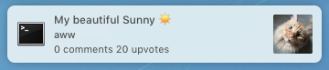

##About
A small script that fetches a random post from reddit and displays it as a notification.



The notification is a clickable link to the comments.

##Why
Why not?

##Install

`npm install reddit-me`

Or install globally with `npm install -g reddit-me` to use anywhere from the command-line.

##Usage
### Command-line
Display a random post:

`reddit-me`

Display a random post from specific subreddits:

`reddit-me -s aww pics`

### JavaScript
```javascript
var redditMe = require('reddit-me');

redditMe(['aww', 'pics']);
```
